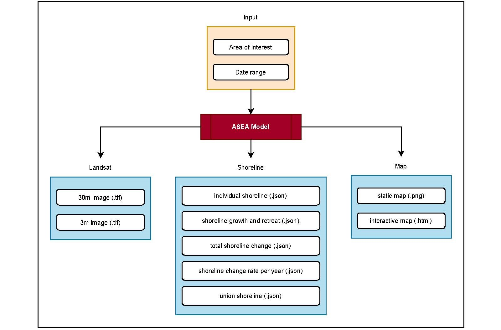

[]

# ASEA-Model

**Automated Shoreline Extraction and Analysis Model** known as **ASEA model** is a robust and
user-friendly model capable of extracting the shoreline from Landsat satellite imagery at a
high accuracy and calculating the shoreline change between the past and present condition.
The model is fully operated in a cloud platform connecting to Google Earth Engine
(GEE) so that the complicated environment setup is not needed in local computer to utilize
this model. By giving the target area and date range as input information, the model will
automatically collect all Landsat satellite images at the given area of interest (AOI) during
high and low tide period, process them, and download the post-processed images directly
from GEE to user’s Google drive. From post-processed images, the model analyzes the
sub-pixel values of Near-Infrared Band and classify them into land and water area by using
an unsupervised classification algorithm known as K-Means. The boundary dividing land
and water area is determined as preliminary shoreline, which basically has stair-like shape.
This shoreline is then converted to a smooth shoreline through shape-correction process in
the model. The shape-corrected shoreline is treated as the main shoreline for calculating
growth and retreat distance and rate per year between the past and present time based on transect
method. By using ASEA model, several kinds of output will be produced in various format ranging from images
in raster file (.tif) to shorelines in geojson file (.json) as well as the analysis results in static
and interactive maps.

## Requirement
To use ASEA model, Google Colaboratory and Google Earth Engine are required to implement
the execution codes. GC and GEE are two completely different platforms. Google
Colab is a place where execution codes of ASEA model are executed, while GEE is a place
where geometry of AOI is generated and also where all Landsat satellite imageries are stored
and downloaded by the model for analysis.

## Model structure
ASEA is a model developed using Python programming language and mainly operated in
Colab. It also can be run in local computer or other cloud platforms besides Colab; however,
the environment setup might be different, and users have to take this into account and install
necessary modules by themselves before use. This model is highly recommended to run in
Colab because Colab has many built-in modules and simple authorization workflow to connect
Google Earth Engine through Notebook Authenticator verification code which faciliates
the use of ASEA model.

