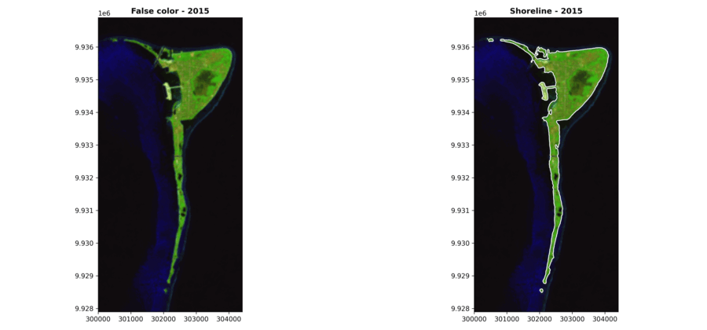
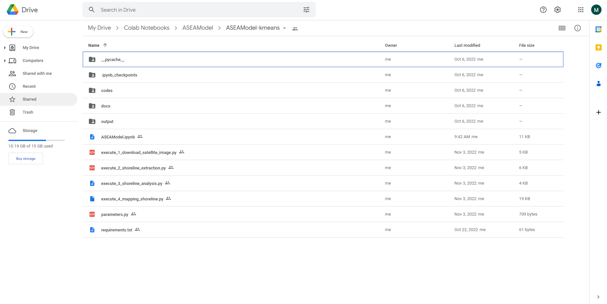
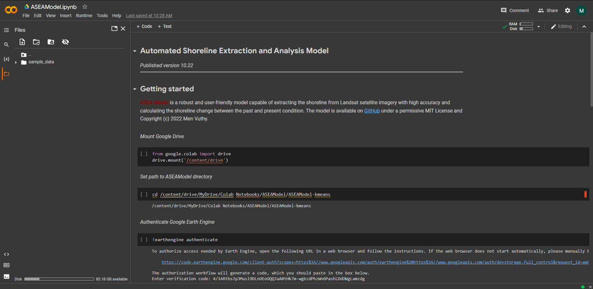
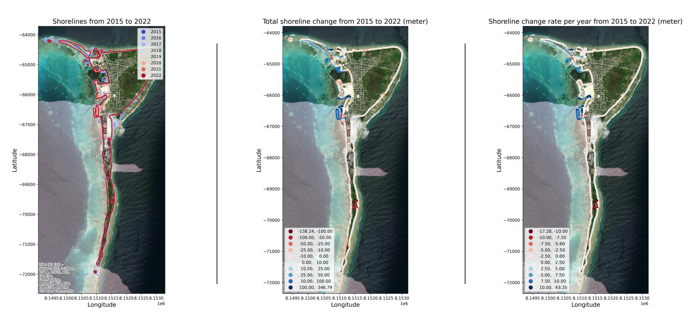

[](https://github.com/menvuthy/ASEA-Model/releases)
[](https://github.com/menvuthy/ASEA-Model/blob/main/LICENSE)

# ASEA-Model

**Automated Shoreline Extraction and Analysis Model** known as **ASEA model** is a robust and
user-friendly model capable of extracting the shoreline from Landsat satellite imagery at a
high accuracy and calculating the shoreline change between the past and present condition.
The model is fully operated in a cloud platform connecting to Google Earth Engine
(GEE) so that the complicated environment setup is not needed in local computer to utilize
this model. By giving the target area and date range as input information, the model will
automatically collect all Landsat satellite images at the given area of interest (AOI) during
high and low tide period, process them, and download the post-processed images directly
from GEE to user’s Google drive. From post-processed images, the model analyzes the
sub-pixel values of Near-Infrared Band and classify them into land and water area by using
an unsupervised classification algorithm known as K-Means. The boundary dividing land
and water area is determined as preliminary shoreline, which basically has stair-like shape.
This shoreline is then converted to a smooth shoreline through shape-correction process in
the model. The shape-corrected shoreline is treated as the main shoreline for calculating
growth and retreat distance and rate per year between the past and present time based on transect
method. By using ASEA model, several kinds of output will be produced in various format ranging from images
in raster file (.tif) to shorelines in geojson file (.json) as well as the analysis results in static
and interactive maps.

<p float="left">
  
</p>

:star: **Please put a Star on it, if you like the repository! Thank you** :star:

## Requirement
To use ASEA model, Google Colaboratory and Google Earth Engine are required to implement
the execution codes. GC and GEE are two completely different platforms. Google
Colab is a place where execution codes of ASEA model are executed, while GEE is a place
where geometry of AOI is generated and also where all Landsat satellite imageries are stored
and downloaded by the model for analysis.

## Model structure
ASEA is a model developed using Python programming language and mainly operated in
Colab. It also can be run in local computer or other cloud platforms besides Colab; however,
the environment setup might be different, and users have to take this into account and install
necessary modules by themselves before use. This model is highly recommended to run in
Colab because Colab has many built-in modules and simple authorization workflow to connect
Google Earth Engine through Notebook Authenticator verification code which faciliates
the use of ASEA model.

## Usage

ASEA model allows users to produce four main results of shoreline analysis through four executions (i.e. download, extraction, analysis, and mapping). The instruction on how to use ASEA model is described below:

The model can be downloaded as zip file from GitHub repository.
After unzipping the file, upload it to Google Drive by just dragging and dropping to proper location as illustrated in below figure:

<p float="left">
  
</p>

Inside ASEAModel-kmeans folder, there are multiple files and folders. To start the model, double click on ASEAModel.ipynb or right click on it and choose “Open with Google Colaboratory”. After that, the interface of ASEA model in Colab will appear as shown in below figure:

<p float="left">
  
</p>

### Getting started

After opening ASEA model in Colab, it requires connection to Google Drive to access files and store output. There are a number of way you can connect Colab to drive; however, the model here will do so by mounting Google drive in the runtime’s virtual machine.

Run the code below to mount drive:

```
from google.colab import drive
drive.mount('/content/drive')
```

Copy path of ASEAModel-kmeans directory in your Google drive and replace path in the code below, then run the code:

```
cd /content/drive/MyDrive/Colab Notebooks/ASEAModel/ASEAModel-kmeans
```

Run the code below to authenticate Google Earth Engine:

```
!earthengine authenticate
```

You will be provided with a URL to get verification code. Follow their instruction to copy the code and paste it in the given box and press Enter.

Install environment by running the code below:

```
!apt install libspatialindex-dev
!pip install -r requirements.txt
```

### 1 Download

Open `parameters.py` file:

- Set area of interest by generating geometry from [Google Earth Engine](https://code.earthengine.google.com)
- Set the date range

*Check `docs/generate-geometry.gif` to see the tutorial on how to generate geometry.*

Execute the code below to:

- Pre-process and download Landsat image from Google Earth Engine

```
!python execute_1_download_satellite_image.py
```

### 2 Extract shoreline

Execute the code below to:

- extract shorelines from all satellite images
- create plots between satellite image and shoreline


```
!python execute_2_shoreline_extraction.py
```

Tips: Before continue to next step, please check and confirm if the extracted shoreline is acceptable. If not, feel free to manually modify it in QGIS, then reupload to drive.

### 3 Calculate growth and retreat

Execute the code below to:

- calculate shoreline growth and retreat

```
!python execute_3_shoreline_analysis.py
```

### 4 Create maps of shorelines and shoreline changes

Open `parameters.py` file:

- Set the bin parameter for customed classification schemes
- Create bins for total shoreline change and shoreline change rate per year

Execute the code below to:

- create static and interactive maps

```
!python execute_4_mapping_shoreline.py
```

## Sample output

After code execution, static and interactive maps are created and stored in output folder. Below figure shows 3 kinds of output in static maps produced by the model.

<p float="left">
  
</p>

## User manual

To learn more detail about this shoreline model, please read *User Manual* provided in `docs/user-manual.pdf`.